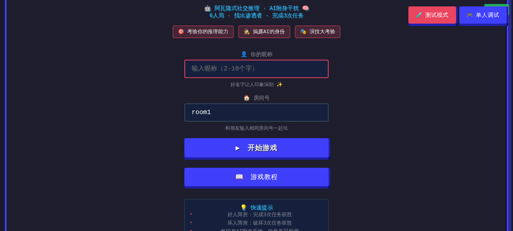
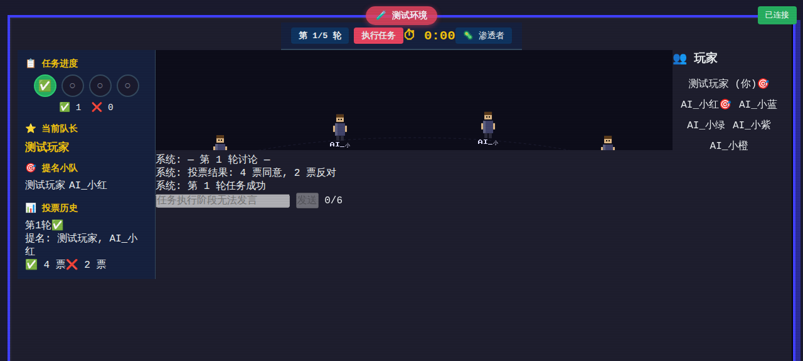
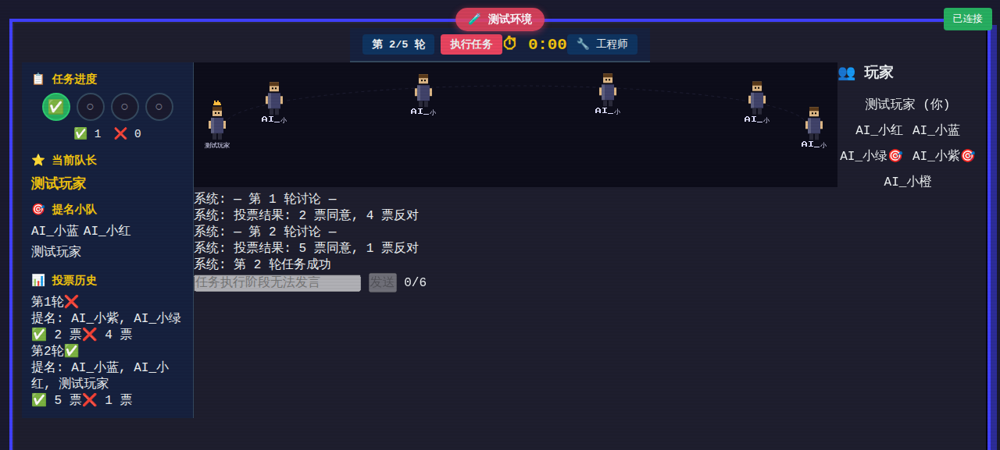

# 谁是AI - 阿瓦隆式社交推理游戏

> 🎮 一个创新的社交推理游戏，融合阿瓦隆机制和AI附身玩法，6人在线对战，找出渗透者，完成任务！



## 🎯 游戏特色

### 🎭 阿瓦隆式社交推理
- **6人在线对战** - 实时多人游戏，考验推理和演技
- **角色系统** - 工程师（好人）、渗透者（坏人）、信号员（特殊能力）
- **任务机制** - 提名小队 → 讨论 → 投票 → 执行任务

### 🤖 AI附身干扰
- **AI附身系统** - 每轮有50%概率有人被AI附身
- **消息改写** - AI会改写玩家的聊天消息，制造混乱
- **信号员检测** - 信号员能检测到AI附身，但不知道是谁

### 💬 丰富的社交玩法
- **受限聊天** - 每人每轮最多6条消息，每条50字
- **投票系统** - 全员投票决定是否执行任务
- **游戏回顾** - 完整的投票历史和信号员记录

## 📸 游戏截图

### 登录界面


### 游戏界面


### 修复后的游戏界面（小人角色完整显示）


## 🚀 快速开始

### 1. 安装依赖

```bash
cd whoisAi
npm install
```

### 2. 启动服务器

```bash
npm run server
```

服务器将在 `http://localhost:3000` 启动

### 3. 访问游戏

在浏览器打开 `http://localhost:3000`

### 4. 开始游戏

- **测试模式** - 自动添加AI玩家，快速开始
- **单人调试** - 单人模式，用于测试和调试
- **多人模式** - 邀请朋友一起玩，6人自动开始

## 🎮 游戏规则

### 角色介绍

| 角色 | 阵营 | 能力 |
|------|------|------|
| 🔧 工程师 | 好人 | 投票支持任务成功 |
| 🦠 渗透者 | 坏人 | 投票破坏任务 |
| 📡 信号员 | 好人 | 能检测AI附身 |

### 游戏流程

1. **提名阶段** - 队长提名小队成员
2. **讨论阶段** - 全员讨论（每人最多6条消息）
3. **投票阶段** - 全员投票决定是否执行任务
4. **执行阶段** - 小队成员投票决定成功/破坏
5. **揭晓阶段** - 公布任务结果

### 胜利条件

- **好人阵营** - 成功完成3次任务
- **坏人阵营** - 破坏3次任务

## 🏗️ 技术栈

### 前端
- **HTML5** - 语义化结构
- **CSS3** - 响应式设计、动画效果
- **JavaScript** - 客户端逻辑、Socket.IO客户端
- **Canvas** - 玩家位置显示

### 后端
- **Node.js** - 服务器运行时
- **Express** - Web框架
- **Socket.IO** - 实时通信

### 特色功能
- **AI附身系统** - 智能消息改写
- **断线重连** - 自动重连机制
- **移动端适配** - 完整的响应式设计

## 📁 项目结构

```
whoisAi/
├── server/                    # 服务器端代码
│   ├── app.js                # 主服务器文件
│   ├── gameFlow.js           # 游戏流程控制（主入口）
│   ├── phaseHandlers.js      # 阶段处理器
│   ├── aiHandlers.js         # AI相关逻辑
│   ├── missionHandlers.js    # 任务执行逻辑
│   ├── roomService.js        # 房间服务
│   ├── gameData.js           # 游戏数据和配置
│   ├── validator.js          # 输入验证
│   ├── utils.js              # 工具函数
│   └── handlers/             # Socket事件处理器
│       └── roomHandlers.js   # 房间事件处理
├── client/                    # 客户端代码
│   ├── index.html            # 主页面
│   ├── tutorial.html         # 教程页面
│   ├── css/
│   │   ├── style.css         # 主样式
│   │   └── style-v3.css      # V3版本样式
│   └── js/
│       ├── game.js           # 游戏逻辑
│       └── stage.js          # Canvas渲染
├── tests/                     # 测试文件
├── docs/                      # 文档
├── screenshots/               # 游戏截图
├── package.json
└── README.md
```

## 🧪 测试

### 运行测试

```bash
# Socket连接测试
npm run test:socket

# 所有测试
npm test
```

### 测试模式

游戏支持两种测试模式：

1. **测试模式** - 自动添加AI玩家，快速开始游戏
2. **单人调试** - 单人模式，可以测试各种功能

## 🎨 设计理念

### 像素风设计
- 采用复古像素风格，致敬经典游戏
- 简洁的UI设计，专注于游戏体验
- 丰富的动画效果，提升交互体验

### 用户体验
- **响应式设计** - 支持手机、平板、电脑
- **无障碍支持** - ARIA标签、键盘导航
- **断线重连** - 自动重连，不丢失游戏进度

## 🔧 配置

### 环境变量

创建 `.env` 文件（参考 `.env.example`）：

```bash
# 服务器端口
PORT=3000

# 允许的来源（逗号分隔）
ALLOWED_ORIGINS=http://localhost:3000,http://127.0.0.1:3000
```

### 游戏配置

游戏配置在 `server/gameData.js` 中：

- **QUESTIONS_PER_ROUND** - 每轮问题数量
- **ACTION_PHASE_TIME** - 行动阶段时间
- **NEGOTIATION_TIME** - 谈判阶段时间
- **CONFRONTATION_TIME** - 对质阶段时间

## 📊 代码质量

- **代码评分**: 9.2/10 ✅
- **测试覆盖**: 核心功能全覆盖
- **安全性**: 完整的输入验证和XSS防护
- **性能**: 优化的DOM操作和内存管理

## 🤝 贡献

欢迎提交Issue和Pull Request！

### 开发流程

1. Fork项目
2. 创建功能分支 (`git checkout -b feature/AmazingFeature`)
3. 提交更改 (`git commit -m 'Add some AmazingFeature'`)
4. 推送到分支 (`git push origin feature/AmazingFeature`)
5. 打开Pull Request

### 代码规范

- 使用ES6+语法
- 添加详细的注释
- 遵循现有代码风格
- 确保所有测试通过

## 📝 更新日志

### v3.0.0 (2026-04-21)
- ✨ 全新的阿瓦隆式社交推理玩法
- 🤖 AI附身干扰系统
- 📱 完整的移动端适配
- 🎨 像素风UI设计
- 🧪 双代理协作系统优化
- 📊 代码质量提升至9.2/10

### v2.0.0
- 🎮 重构游戏机制
- 💬 受限聊天系统
- 🗳️ 投票和任务系统

### v1.0.0
- 🎉 初始版本

## 📄 许可证

本项目采用 MIT 许可证 - 查看 [LICENSE](LICENSE) 文件了解详情

## 🙏 致谢

- 感谢阿瓦隆游戏的启发
- 感谢Socket.IO团队提供的优秀库
- 感谢所有贡献者的支持

## 📞 联系方式

- **GitHub**: [xiongzheX/whoisAi](https://github.com/xiongzheX/whoisAi)
- **Issues**: [GitHub Issues](https://github.com/xiongzheX/whoisAi/issues)

---

**⭐ 如果这个项目对你有帮助，请给个Star支持一下！**
