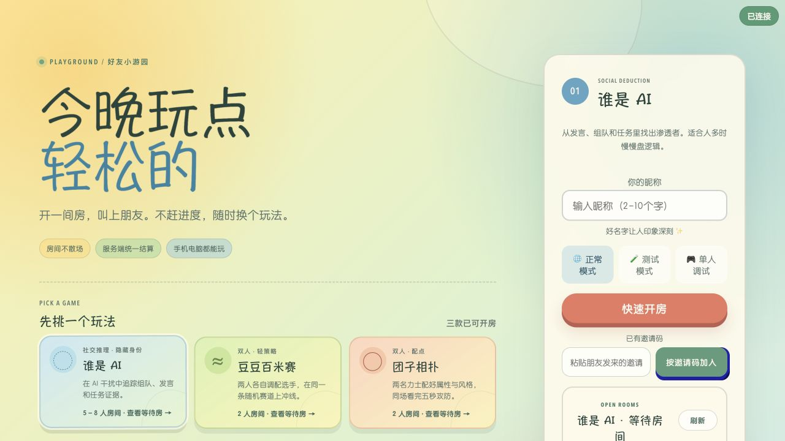
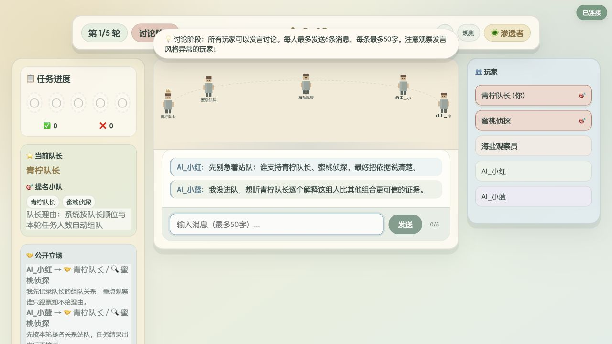
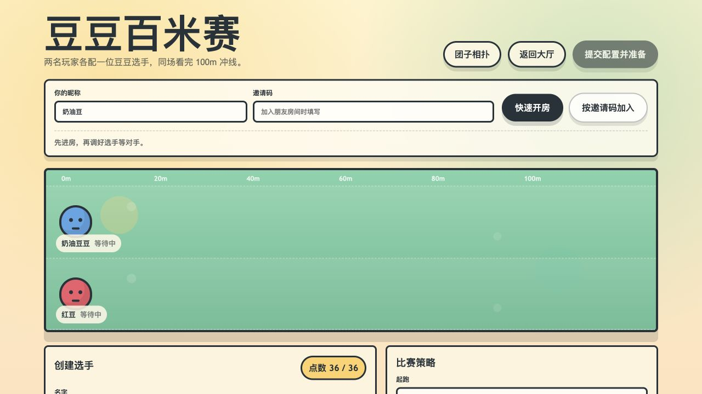
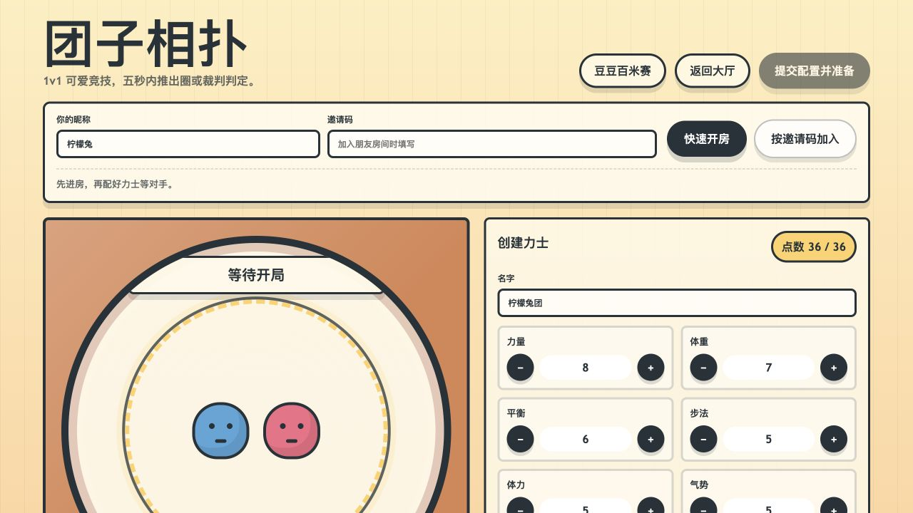

# 好友小游园｜开房即玩的社交小游戏平台

一个面向好友聚会和社交软件场景的轻量多人游戏平台。无需注册账号：选择游戏、创建房间、分享链接，朋友进入后即可开始。

平台提供统一游戏大厅、公开等待房间、邀请链接、断线恢复和原房复玩，内置三款可完整游玩的游戏。所有关键对局结果由 Go 服务端生成，房主浏览器不是权威状态源。

## 可玩游戏

| 游戏 | 类型 | 人数 | 入口 | 一句话玩法 |
| --- | --- | --- | --- | --- |
| 谁是 AI | 社交推理 | 3–8 名真人；不足 5 席时可补 AI | `/` | 从组队、发言、投票和任务结果中找出渗透者 |
| 豆豆百米赛 | 双人轻策略 | 2 名真人 | `/games/bean-sprint/` | 各自调配选手，在同一随机赛道上观看冲线回放 |
| 团子相扑 | 双人轻对抗 | 2 名真人 | `/games/dumpling-sumo/` | 隐藏配点并选择风格，双方准备后观看五秒攻防 |

平台首页会展示每款游戏可加入的等待房间。玩家既可以直接加入，也可以快速开房，无需手动传递房间号。

## 界面预览

### 游戏大厅

三款游戏共享同一个大厅。游戏卡片、开房入口和公开等待房间集中展示，桌面与移动设备均可使用。



### 谁是 AI

正常模式支持 3–8 名真人，少于 5 席时可由房主补充 AI。对局画面同时呈现任务进度、当前队长、公开立场、讨论区和玩家状态。



### 豆豆百米赛

两名玩家各自配置豆豆选手与比赛策略，双方准备后在同一条服务端随机赛道上观看比赛。



### 团子相扑

两名玩家在有限点数内配置力士属性与战斗风格，双方准备后观看同一份五秒攻防回放。



## 快速开始

### 环境要求

- Go 1.24+
- Node.js 18+ 与 npm

### 启动

```bash
npm install
npm start
```

默认访问地址：<http://localhost:3014>

也可以显式指定端口和 Go 构建缓存：

```bash
GOCACHE=/tmp/whoisai-gocache PORT=3014 go run ./cmd/go-server
```

Node 依赖用于提供 Socket.IO 浏览器客户端；页面与实时游戏服务均由同一个 Go 进程托管。

## 两个人如何本地测试

浏览器的每个标签页使用独立的 `sessionStorage` 玩家令牌，因此可以在同一台电脑上模拟不同玩家。为避免浏览器复制标签页时连玩家身份也一起复制，推荐使用普通窗口与无痕窗口各开一个页面。

### 豆豆百米赛 / 团子相扑

1. 玩家 A 打开对应游戏页面，填写昵称并点击“快速开房”。
2. 点击“复制邀请链接”。复制的是完整的 `http://localhost:3014/...?...` 地址，不是只有房间号。
3. 玩家 B 在另一个普通窗口、无痕窗口或另一款浏览器中粘贴链接。
4. 玩家 B 填写不同昵称并加入预填好的房间。
5. 两人分别提交自己的配置并准备。双方都准备后，服务端自动生成同一局结果和回放。
6. 一轮结束后可以选择“再来一局”或使用显著的“返回游戏大厅”入口。

### 谁是 AI：正常模式

1. 房主在大厅选择《谁是 AI》，选择正常模式并快速开房。
2. 将邀请链接发给另外两名测试玩家；至少 3 名真人在线后房主可以开始。
3. 真人不足 5 席时，开局会自动补至 5 名参与者；房间最多支持 8 席。
4. 依次验证身份查看、队长提名、讨论、全员表决、秘密任务和局后复盘。

### 谁是 AI：测试与单人调试

- 测试模式：一名真人进入独立测试房，系统补充 AI 并自动推进其他玩家动作，适合快速走完整局。
- 单人调试：一名真人配合 AI 验证流程，可暂停倒计时并查看调试控制，用于逐阶段检查任务结果与推理面板。
- 测试房与单人房会生成临时房间号，避免与正常好友房互相污染。

## 游戏规则

### 谁是 AI

《谁是 AI》是一款受组队任务类玩法启发的隐藏身份游戏。任务不是答题，而是一次次迫使玩家公开立场、留下可追问的证据。

每轮包含四个阶段：

1. 队长提名行动小队并填写理由。
2. 全员围绕队长选择、历史投票和任务结果进行限量讨论。
3. 全员公开投票是否同意这支小队；平票视为否决，连续五次否决时渗透者获胜。
4. 获批小队秘密执行任务；守护阵营只能执行，渗透阵营可以执行或破坏。

任务结果只公开成功或失败、破坏次数和当轮小队，不公开每个人的秘密行动。守护阵营先完成 3 次任务获胜，渗透阵营先破坏 3 次任务获胜。

AI 干扰是一种信息污染机制：它不会改变玩家阵营，但可能轻微改写一名玩家的发言。侦测者只知道当轮是否存在干扰，不知道具体目标。讨论焦点、可疑事件和投票历史会将前一轮行为转化为下一轮的社交推理材料。

### 豆豆百米赛

两名玩家分别调整选手参数并选择策略。准备前只公开对方是否已经提交，不公开对方的具体配置。双方准备后，服务端冻结配置，随机生成天赋、赛道环境和种子，再返回完全一致的比赛回放与胜负原因。

### 团子相扑

两名玩家在有限点数内构建自己的团子力士并选择战斗风格。双方准备后由服务端生成统一的五秒攻防过程，结果页展示关键回合和胜负原因。重新修改配置会清除上一局准备态，再次准备会创建新的 Session。

## 平台架构

```text
浏览器大厅 / 游戏页面
          │ HTTP + Socket.IO
          ▼
cmd/go-server
          │
          ├── internal/realtime   协议适配、广播与恢复
          ├── internal/platform   游戏目录、好友房间、Session、快照与事件
          ├── internal/game       《谁是 AI》规则与权威状态
          ├── internal/duel       双人游戏的配置、准备、复赛生命周期
          └── runner_race/duel    百米赛与相扑模拟引擎适配层
```

核心数据关系：

```text
GameDefinition
      │
      ▼
PartyRoom 1 ─────── n GameSession
    │                       │
    n                       n
RoomMember          SessionParticipant
                            │
                  Snapshot / Event
```

- `PartyRoom` 保存房主、真人成员、在线/准备状态、当前选择的游戏和活动 Session。
- `GameSession` 冻结单局模式、设置、参与者、状态版本与胜负摘要；复玩会创建新 Session。
- `Snapshot` 分为公共状态和按玩家裁剪的私密状态，重连时直接恢复最新权威快照。
- AI 只属于某局 Session，不占长期好友房成员席位。
- 客户端动作使用 Session 与状态版本门禁，避免旧页面把动作写进新一局。

更完整的领域设计、关系表与状态迁移规则见 [社交小游戏平台底层设计](docs/architecture/social-game-platform.md)。仓库中的 PostgreSQL 表结构设计见 [001_platform.sql](internal/platform/migrations/001_platform.sql)。

> 运行时使用 `platform.MemoryStore`。服务重启后等待房间与对局状态会清空；项目未连接 PostgreSQL。

## HTTP 接口与实时能力

- `GET /api/platform/games`：返回平台游戏目录。
- `GET /api/platform/rooms?gameId=...`：返回某款游戏可加入的公开等待房间。
- `GET /api/platform/rooms/{roomCode}`：返回房间与当前 Session 的恢复信息。
- `/socket.io/`：处理加入、离开、准备、游戏动作、快照同步和断线恢复。

公开房间摘要只包含房间号、游戏、房主昵称、人数与空位，不暴露成员恢复令牌。

## AI 改写配置

《谁是 AI》可以接入兼容 OpenAI Chat Completions 的文本改写接口。未配置、请求失败或超时时会自动使用本地规则，不影响开局。

| 环境变量 | 说明 | 默认值 |
| --- | --- | --- |
| `PORT` | HTTP 监听端口 | `3014` |
| `AI_API_KEY` | 接口密钥 | 空 |
| `AI_BASE_URL` | OpenAI 兼容接口地址 | 空 |
| `AI_MODEL` | 模型名称 | 空 |
| `AI_TIMEOUT_MS` | 请求超时毫秒数 | `8000` |

服务启动时会读取项目根目录的 `.env`。命令行已显式设置的变量不会被覆盖。

## 测试

运行根模块的前端语法检查、平台、实时层和《谁是 AI》测试：

```bash
npm test
```

运行双人模拟模块的完整测试：

```bash
cd runner_race
GOCACHE=/tmp/whoisai-runner-gocache go test ./... -timeout 60s
```

手动双人 Socket.IO 冒烟脚本位于 `test/duel-smoke-client.js`，需要先启动本地服务。

## 项目结构

```text
.
├── client/
│   ├── index.html              平台大厅与《谁是 AI》页面
│   ├── css/                    大厅、推理游戏和双人房间样式
│   └── js/                     大厅、游戏状态与双人房间客户端
├── cmd/go-server/              统一 HTTP / Socket.IO 服务入口
├── internal/
│   ├── ai/                     AI 改写与本地降级
│   ├── duel/                   双人游戏公共生命周期
│   ├── game/                   《谁是 AI》领域规则
│   ├── platform/               平台目录、房间、Session 与迁移
│   └── realtime/               实时协议适配
├── runner_race/
│   ├── duel/                   两款双人游戏的统一适配引擎
│   ├── internal/runner/        百米赛模拟
│   ├── internal/sumo/          相扑模拟
│   └── web/                    两款游戏页面
├── docs/
│   ├── architecture/           平台底层设计
│   └── reviews/                玩法与体验审查记录
├── test/                       本地联机冒烟脚本
├── go.mod
└── package.json
```

## 运行边界

- 房间和 Session 存储在内存中，服务重启后不会保留。
- 游戏由平台内置注册，不支持第三方上传任意游戏代码。

Made by xiongzheX
