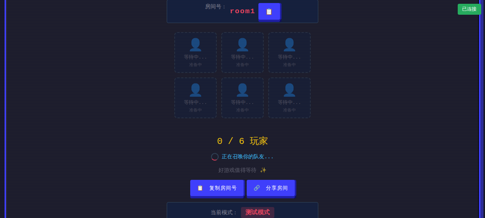

# 谁是AI v3 — 阿瓦隆式社交推理

> 5-8人局 · 推荐6人 · 找出渗透者 · 完成3次任务  
> 🤖 AI附身干扰 · 🧠 斗智斗勇

---

## 📸 界面截图

### 登录页



### 对局页


### 结算页


---

## 🎮 游戏规则

### 角色（推荐6人）
- **守护者**（守护者阵营）：3名  
  目标：完成3次任务，识别并阻止渗透者
- **渗透者**（渗透者阵营）：1名  
  目标：诱导3次任务失败，并隐藏身份
- **侦测者**（守护者阵营特殊）：1名  
  特殊能力：获得本轮是否存在 AI 干扰的线索，但不知道具体是谁
- **AI 玩家**（模拟真人）：1名  
  测试/单人模式下由系统补齐，用于验证流程

### 核心机制

#### AI 附身系统
- 每轮有概率出现 1 名玩家被 AI **干扰**
- 被干扰玩家会收到提示，且发言可能被轻微改写
- 侦测者知道本轮是否存在干扰，但不知道具体目标

#### 身份判断闭环
- 队长提名是公开立场暴露
- 全员投票是公开承诺
- 任务结果只公开整体成功/失败和高风险行动次数，不公开个人行动归属
- 失败后会生成“讨论焦点”和“可疑事件”，引导下一轮追问队长、队员和支持票

#### 游戏流程（最多5轮）

每轮 = 4 个阶段：

**① 提名小队**（15秒）  
队长选择本轮行动小队，其他玩家据此判断队长立场

**② 受限讨论**（45秒）  
每人最多说 6 句话，每句 ≤ 50 字  
重点讨论：
- 队长为什么选择这支小队
- 谁在无理由支持或反对这支队伍
- 上一轮任务和投票记录里，谁的立场需要解释

**③ 投票表决**（20秒）  
全员投票赞成/反对该小队  
平票视为否决，连续 5 次否决则渗透者直接获胜

**④ 执行任务**  
赞成票 ≥ 半数 → 任务执行  
任务执行：小队成员围绕危机场景选择行动方案

任务结果判定：
- 没有出现高风险行动 → 任务成功（守护者+1）
- 出现高风险行动 → 任务失败（渗透者+1）
- 系统公开：
  - 任务成功/失败
  - 本轮高风险行动次数
  - 行动小队名单
- 系统隐藏：
  - 每个小队成员具体选择了什么

**胜利条件**：
- 守护者阵营：3 次任务成功
- 渗透者阵营：3 次任务失败

---

## 🧠 当前玩法重点

- 这不是答题游戏。危机行动选项的作用是制造立场分歧，而不是考知识。
- 任务失败后，重点不在“谁点错了”，而在“这支失败小队里谁可疑、谁支持了它、谁需要解释”。
- AI 干扰是信息污染机制，不会改变玩家阵营，只会影响你对发言可信度的判断。
- 当前版本已经加入“讨论焦点”和“可疑事件”面板，用来把投票与任务结果转成下一轮的讨论材料。

---

## 🚀 快速开始

```bash
# 安装依赖（前端 Socket.IO client 资源）
npm install

# 启动 Go 服务
GOCACHE=/tmp/whoisai-gocache PORT=3014 go run ./cmd/go-server

# 打开浏览器
# http://localhost:3014
```

### 环境变量

- 当前 `.env.example` 只用于说明 Go 后端实际读取的 `PORT`
- 你可以复制 `.env.example` 为 `.env`，也可以直接在启动命令前注入环境变量
- 默认示例端口是 `3014`

### 游戏模式

| 模式 | 人数 | 说明 |
|------|------|------|
| 正常模式 | 5-8人 | 真人好友同房，首位玩家在至少5人到齐后开始 |
| 测试模式 | 1+AI | 自动补 AI 并自动推进，适合快速验证流程 |
| 单人调试 | 1+AI | 单人流程演示，显示调试信息，适合验证任务揭晓和推理面板 |

### 当前实现状态

- 当前仓库只保留 Go 后端：
  - `cmd/go-server`
  - `internal/game`
  - `internal/realtime`
- Go 服务已支持：
  - 房间模式锁定
  - AI 干扰消息改写
  - 侦测者线索事件
  - 半隐藏任务揭晓
  - 讨论焦点 / 可疑事件面板
- 当前仍在继续打磨：
  - 讨论阶段“信任 / 怀疑”轻量表态
  - 局后复盘里的判断正确率展示
  - 自动流程下的节奏优化

---

## 📂 项目结构

```
whoisAi/
├── cmd/
│   └── go-server/
├── internal/
│   ├── game/
│   └── realtime/
├── client/
│   ├── index.html
│   ├── js/game.js
│   └── css/style-v3.css
├── package.json
└── go.mod
```

---

**Made by xiongzheX**
